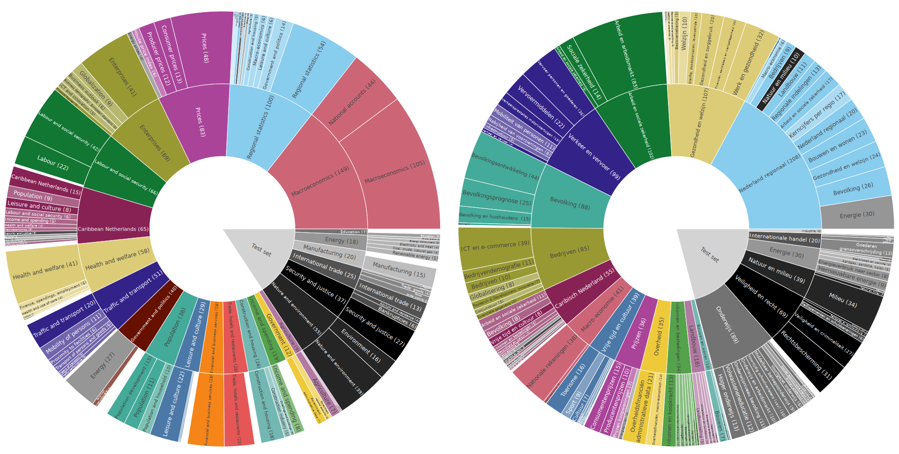

# 🦗 LOCuST: Large-scale Official statistics Complex text-to-SQL task (v0.3)

## Introduction
LOCuST is a large-scale text-to-SQL benchmark on real-world statistical data provided by [Statistics Netherlands](https://www.cbs.nl/en-gb/).
Our benchmark contains over 2,000 English and Dutch tables covering 22 statistical domains. In concrete, our datasets provide the following:
* 2,244 tables containing real-world statistics;
* table schemas ranging from small (< 5 columns) to very  large (> 1,200 columns);
* a coverage of 22 statistical domains;
* 2,567 manually annotated complex questions and answers;
* an extensive metadata knowledge graph accompanying the tables, containing labels, descriptions, units, and other associated metadata for covered concepts.

Our benchmark consists of three tasks: (1) table retrieval; (2) query generation, where tables are given; and (3) end-to-end QA,
which is a combination of table retrieval and query generation. All tasks are run on the same question-answer data.

***All results can be found on [the leaderboard](https://lagewel001.github.io/LOCuST/).***

Alongside the text-to-SQL benchmark, we also provide data and code for running custom S-expressions for those interested. 
S-expressions can be (more) easily translated to Open Data API queries. When running the benchmark as text-to-SQL, all 
S-expression related content can be ignored.


## Overview
This repository contains the code and training and test data for running the benchmark. The data tables are provided as downloads below.
As a quick reference, the following directories are included:
* `data/qa_pairs/<lang>/` contains the training and test set for question-answer pairs.
* `evaluation/` contains all the evaluation scripts for running and evaluating models.
* `models/retrievers/` place your table retrieval models here. New models should inherit from [base_retriever](./models/retrievers/base_retriever.py).
* `models/generators/` place your query genration models here. New models should inherit from [base_generator](./models/generators/base_generator.py).
* `odata_graph/` contains the code and graph files for the accompanying metadata graph.
[sparql_controller](./odata_graph/sparql_controller.py) contains convenience functions for using the graphs.
* `pipeline/` contains modules for executing (SQL/S-expression) queries on the dataset (using parquet files) or the CBS Open Data API (as long as it is supported)
* `s_expression/` contains the syntax and logic for running the benchmark using S-expressions instead of SQL.
* `tests/` contains unit tests for the S-expression logic.


## Dataset downloads
The total size of the datasets when extracted are 2.03 GB (en) and 4.68 GB (nl)
* [Here you can download the **English** OData3 tables](https://locustdataset.blob.core.windows.net/locust-dataset-odata3-tables/en.zip) (592 MB)
* [Here you can download the **Dutch** OData3 tables](https://locustdataset.blob.core.windows.net/locust-dataset-odata3-tables/nl.zip) (1.44 GB)

The dataset files (parquet) should be downloaded extracted to [data/en/odata3](./data/en/odata3/) and [data/nl/odata3](./data/nl/odata3/) respectively.

The graphs files should be downloaded and put under [odata_graphs/graphs](./odata_graph/graphs)
* [Here you can download the **English** graph](https://locustdataset.blob.core.windows.net/locust-dataset-odata3-tables/cbs-en.trig)
* [Here you can download the **Dutch** graph](https://locustdataset.blob.core.windows.net/locust-dataset-odata3-tables/cbs-nl.trig)

The question-answers pairs can be found under [data/qa_pairs](./data/qa_pairs).

The train and test questions contain the following domain-spread:



## Setup
**Prerequisites:** Python3.13 is installed.

1. Download and extract the table and graph files as described above.
2. Install the requirements in a virtual environment using `pip install -r requirements.txt`.
3. New table retrieval models should inherit from [base_retriever](./models/retrievers/base_retriever.py).<br>
New query generation models should inherit from [base_generator](./models/generators/base_generator.py).
4. All evaluation scripts should be run with the root of this repository set as the PYTHONPATH<br>
For evaluating models, use the following commands for each task as a reference:
   - **Table retrieval:**<br>
   ```
   env PYTHONPATH=. LANGUAGE=<lang> python3 ./evaluation/evaluate_table_retrieval.py --model_path <my_model.py> --query_type sql --k <k> --mode table
   ```
   - **Query generation:**<br>
   ```
   env PYTHONPATH=. LANGUAGE=<lang> python3 ./evaluation/evaluate_query_generation.py --model-path <my_model.py> --query_type sql --output_path <path.json> --results_path <path.json> --task query-only
   ```
   - **End-to-end QA:**<br>
   ```
   env PYTHONPATH=. LANGUAGE=<lang> python3 ./evaluation/evaluate_query_generation.py --model-path <my_model.py> --query_type sql --output_path <path.json> --results_path <path.json> --task end-to-end
   ```

For debugging purposes, it can be useful to import the metadata graph .trig files to a GraphDB instance. When running the evaluation
scripts with an external graph, the environment variable `LOCAL_GRAPH` must be set to `True` and the following environment variables must be set:
`GRAPH_DB_HOST`, `GRAPH_DB_USERNAME`, `GRAPH_DB_PASSWORD` and `GRAPH_DB_REPO`.

## Contact
All questions and feedback is appreciated. Feel free to contact us by mailing to [l.lageweg@cbs.nl](mailto:l.lageweg@cbs.nl)
or by opening a Github issue here.

## FAQ
> Is the original data open source?

Yes. All data in the dataset is published license free by Statistics Netherlands in accordance with the [Statistics Netherlands Act (Wet op het Centraal bureau voor de statistiek)](https://wetten.overheid.nl/BWBR0015926/2025-09-01).

> Does the dataset contain any confidential or privacy-sensitive information?

No. All data is anonymized and not traceable to any individual or organization, [in accordance with Statistics Netherlands](https://www.cbs.nl/en-gb/about-us/who-we-are/our-organisation/privacy) 
and validated through the [Data Privacy Impact Assessment](https://www.cbs.nl/-/media/cbs/over-ons/organisatie/cbs-standaard-cbspia-2021-v2-1-eng.pdf) 
and [ISO 27001](https://www.cbs.nl/-/media/cbs/over-ons/organisatie/certificate--iso-iec-27001-cbs.pdf).

> Can I use this dataset for doing statistics?

No. The tables in the dataset concern all the actively maintained tables by Statistics Netherlands as of 2025-06-17. Since then, statistics might have been added, updated or become obsolete. The data in this dataset are real-world statistics, but because of the static nature of the dataset cannot be used for doing statistical analyses. If needed, please consult Statistics Netherlands for the most recent statistical observations.

> Will you keep updating the dataset?

Yes. We plan to keep updating the dataset with more question types and more difficult questions. We do not plan to increase number of tables.

> Will you add support for the SDMX format?

There are currently no plans to make our data available in SDMX for this benchmark.

> How can I evaluate my model on this benchmark?

The entire dataset, benchmark code and instructions are available in this repository. Results can be forwarded to [l.lageweg@cbs.nl](mailto:l.lageweg@cbs.nl) for verification and mentioning on [the leaderboard](https://lagewel001.github.io/LOCuST/).

> Can I continue building on the benchmark or use this data for my own dataset?

Yes. All data is published license free and can be used for your own research or projects. Please always reference this and/or the original source. For more questions on expanding the benchmark and collaborations, don't hesitate to contact (one of) the authors.
